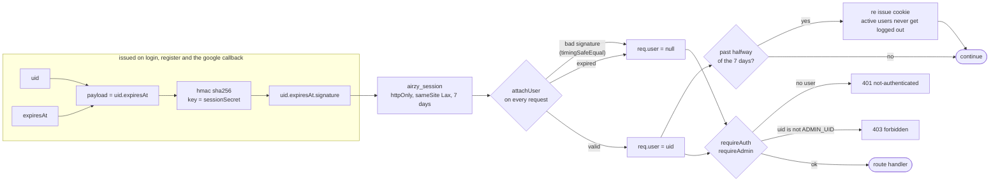
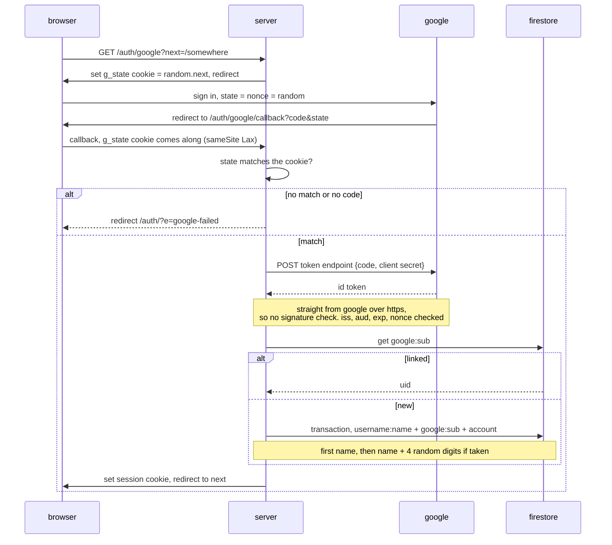
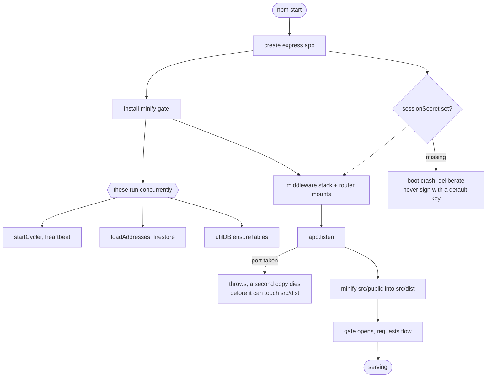
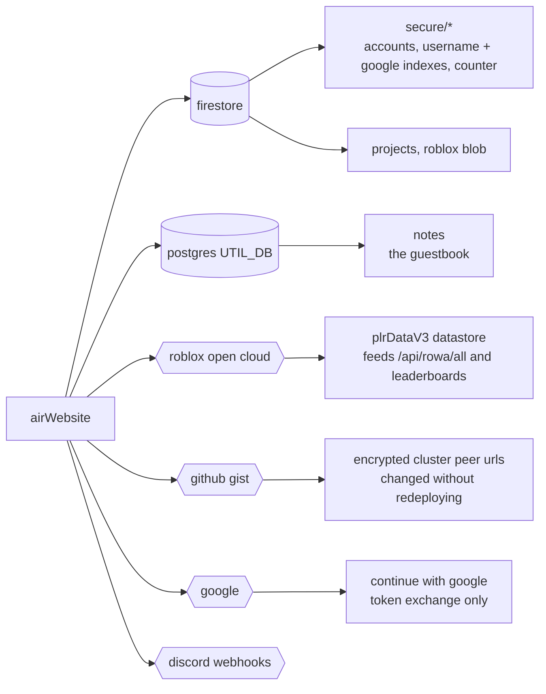
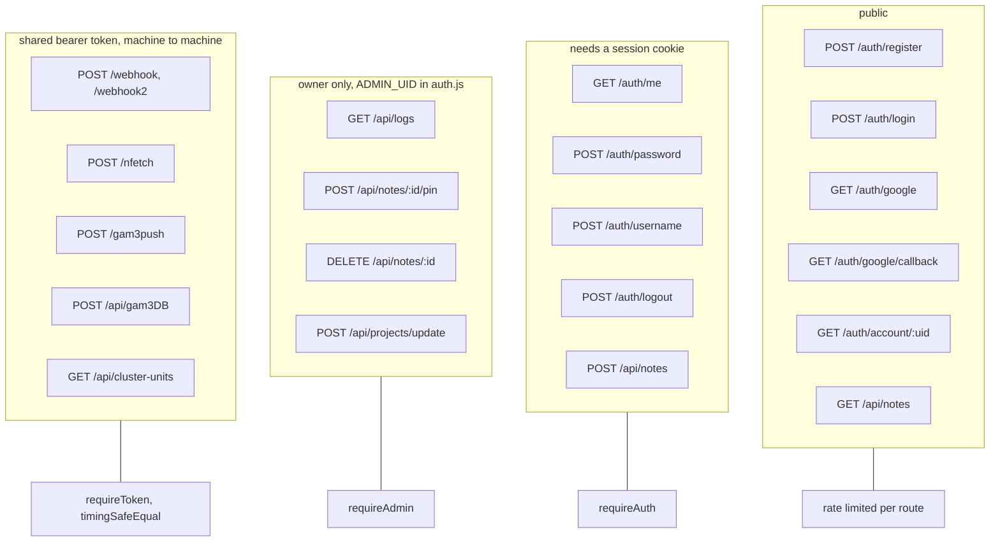

# Architecture

Diagrams only. Prose lives in the README.

## Request lifecycle

## Session cookie

## Register, one Firestore transaction

```mermaid
sequenceDiagram
  participant C as client
  participant R as register.js
  participant M as accountsManager
  participant F as firestore

  C->>R: POST /auth/register {name, password}
  R->>M: register()
  M->>M: normalize + validate name, password
  M->>M: argon2 hash

  rect rgb(40,40,40)
    Note over M,F: transaction, all reads before any writes
    M->>F: get username:name
    F-->>M: exists?
    M->>F: get counter
    F-->>M: nextId

    alt username taken
      M-->>R: throw username-taken
      R-->>C: 409
    else free
      M->>F: set counter = nextId + 1
      M->>F: set secure/uid = account
      M->>F: set username:name = uid
    end
  end

  M-->>R: account
  R->>C: set session cookie
  R-->>C: 200 {uid, name} (already logged in)
```

## Continue with google, openid connect without a library

## Boot sequence

## Where data lives

## Auth surface

